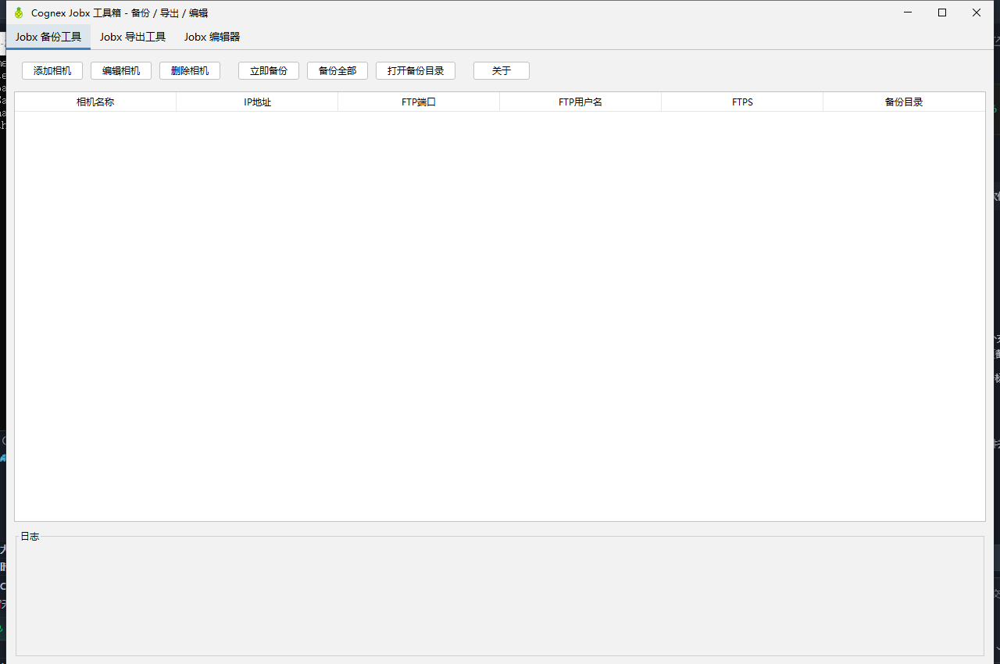
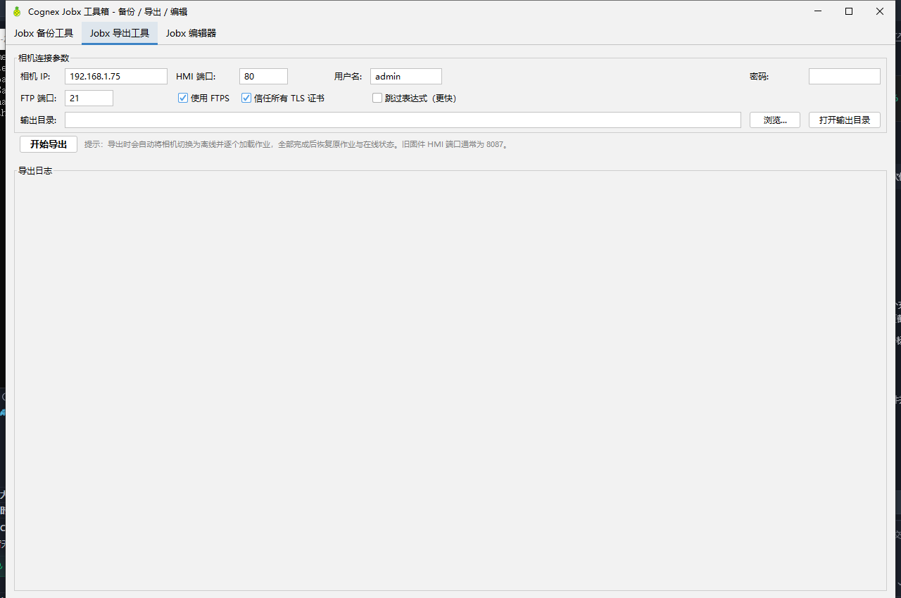
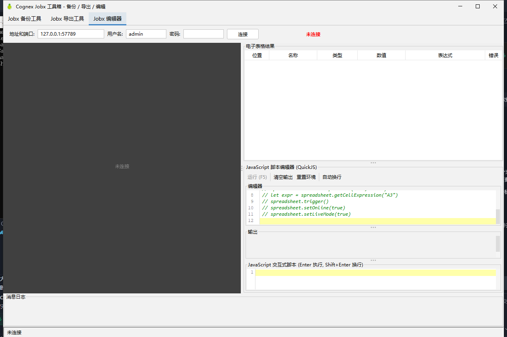

<div align="center">

.png)

# Cognex Jobx 工具箱 / Cognex Jobx Toolbox

</div>

[English](#english) | [中文](#中文)

---

## 中文

一个基于 Java Swing 的 Cognex 视觉相机作业（`.jobx`）综合工具，主窗口为三个标签页：

1. **Jobx 备份工具**：通过 FTP/FTPS 从相机递归下载 `.jobx` 及 `.jobx.sig`，按 `备份目录/相机名称/yyyyMMddHHmmss/` 时间戳归档备份；
2. **Jobx 导出工具**：FTP/FTPS 枚举相机上的全部作业，经 CogSocket HMI 逐个加载并读取电子表格单元格的**值与表达式**，为每个作业生成一个 A4 打印友好的 xlsx；
3. **Jobx 编辑器**：CogSocket HMI 客户端，支持实时图像、电子表格单元格查看/编辑、手动触发、在线/离线与实时模式、相机信息查看、XML 导出，以及内置 QuickJS 的 JavaScript 脚本编辑器。

### 功能特性

**① Jobx 备份工具**

- **多相机配置管理**：增删改相机配置，自动保存到 JSON（jar 所在目录的 `backup-config.json`）
- **单个 / 全部备份**：手动触发任一相机或全部相机的备份
- **FTP 与显式 FTPS（TLS）支持**：FTPS 默认信任所有证书（适合相机自签名证书），可关闭后走 JVM 默认证书校验
- **UTF-8 文件名（RFC 2640）**：中文文件名不乱码（登录后自动发送 `OPTS UTF8 ON`）
- **界面内实时操作日志**：备份过程状态一目了然

**② Jobx 导出工具**

- 一键流程：FTP/FTPS **递归枚举**相机上的全部 `.jobx` → 经 **CogSocket HMI** 连接（自动切换为离线并等待加载完成）→ 逐个加载作业 → 读取 `A0:Z599` 范围内全部单元格的**值与表达式** → 导出完成后**自动恢复原作业与在线状态**
- 每个作业生成一个独立 xlsx，含「单元格」与「位置布局」两个工作表，**A4 纵向、打印友好**
- 可勾选「跳过表达式（更快）」：只读单元格值，不逐格回读表达式
- 支持配置 HMI 端口（新固件 **80**、旧固件 **8087**、模拟器为随机端口）与 FTPS/TLS；输出默认在 jar 目录下 `exports/yyyyMMddHHmmss/`

**③ Jobx 编辑器**（CogSocket HMI 客户端）

- **实时图像**显示与「实时模式」切换
- **电子表格结果**表：位置 / 名称 / 类型 / 数值 / 表达式 / 错误，一目了然
- 单元格读写：**设置单元格值、设置单元格表达式、获取单元格表达式**（双击表格也可编辑）
- **手动触发**作业、**在线/离线**切换、**关于相机**信息查看、将作业结果**导出为 XML**
- **JavaScript 脚本编辑器（QuickJS）**：F5 运行整段脚本，内置 `spreadsheet` API（触发、读写单元格、切换在线/实时模式等），另带交互式脚本输入框（Enter 执行、Shift+Enter 换行）
- **深色 / 浅色主题**切换，图像 / 电子表格 / 脚本编辑器三个面板可按需显示隐藏
- 连接参数与界面偏好自动保存到 jar 所在目录的 `config.json`

**通用**

- 纯 Java Swing 单 fat jar，备份 / 导出 / HMI 编辑功能 **JRE 8+** 即可运行
- **JavaScript 脚本功能需要 JDK 19+**（QuickJS 本地库限制）；低版本 JDK 下脚本功能给出友好提示，不影响其他功能

### 软件截图

| Jobx 备份工具 | Jobx 导出工具 | Jobx 编辑器 |
| :---: | :---: | :---: |
|  |  |  |
| 多相机配置管理，FTP/FTPS 递归备份并按时间戳归档 | 枚举相机全部作业，读取单元格值与表达式，导出 A4 打印友好 xlsx | CogSocket HMI 客户端：实时图像、电子表格编辑、QuickJS 脚本 |

### 构建与运行

环境要求：**JRE/JDK 8+**（编辑器中的 QuickJS JavaScript 脚本功能需要 **JDK 19+**，其余功能不受影响）。

```bash
# Windows
gradlew.bat build
# Linux / macOS
./gradlew build
```

`build` 会自动触发 `fatJar` 任务，产物在 `build/libs/` 下：

- `cognex-jobx-backup-1.0.0-all_<时间戳>.jar` — 包含全部依赖的可执行 fat jar（发布用）
- `cognex-jobx-backup-1.0.0.jar` — 仅项目代码的瘦 jar

运行：

```bash
java -jar build/libs/cognex-jobx-backup-1.0.0-all_<时间戳>.jar
```

也可以使用一键发布脚本（打包并复制带时间戳的 jar 到项目根目录，命名为 `jobx文件备份助手_*.jar`）：

```bash
./build-with-timestamp.sh
```

### 技术栈

| 技术 | 版本 | 用途 |
| --- | --- | --- |
| Java | 8（source/target 1.8） | 全部业务代码，JRE 8+ 可运行 |
| Swing UI + FlatLaf | 3.4.1 | 界面（FlatLightLaf / FlatDarkLaf 主题） |
| Apache Commons Net | 3.11.1 | 备份 / 导出的 FTP/FTPS 客户端 |
| Java-WebSocket | 1.5.6 | 编辑器 / 导出的 CogSocket HMI 通信 |
| Apache POI（poi-ooxml） | 5.2.5 | 导出 xlsx |
| RSyntaxTextArea | 3.4.0 | JavaScript 脚本编辑器语法高亮 |
| QuickJS（cn.net.zhijian.quickjs） | 0.2.2 | JS 脚本引擎（本地 jar，运行需 JDK 19+） |
| Gson / slf4j-simple | 2.10.1 / 2.0.13 | 配置 JSON 序列化 / 日志 |
| Gradle | 带 wrapper（`gradlew.bat` / `./gradlew`） | 构建 |

### 代码结构

```
src/main/java/com/cognex/
├── backup/                    # 标签页1：备份工具
│   ├── Main.java              # 入口：设置 FlatLaf 主题，启动 MainFrame
│   ├── config/ConfigManager.java  # backup-config.json（jar 所在目录，UTF-8）
│   ├── ftp/FtpClient.java     # FTP/FTPS、OPTS UTF8 ON、递归下载 + listJobxFiles()（供导出复用）
│   ├── model/                 # CameraConfig、AppSettings
│   ├── util/AppIcons.java     # 应用图标（窗口 / 任务栏多尺寸图标）
│   └── ui/                    # MainFrame（三标签容器）、BackupTabPanel、CameraDialog、关于/使用说明
├── export/                    # 标签页2：导出工具
│   ├── ExportTabPanel.java    # 参数表单 + 日志，后台线程执行
│   ├── ExportTask.java        # 枚举 → HMI → 离线 → 逐作业读值/读表达式 → xlsx → 恢复
│   └── XlsxExporter.java      # POI：「单元格」+「位置布局」两个工作表，A4 纵向
└── insight/                   # 标签页3：HMI 编辑器
    ├── cogsocket/             # CogSocketClient、InSightConnection（连接/登录/loadJob/单元格读写/在线状态）
    ├── model/、config/        # HMI 数据模型；AppConfig / InsightConfigManager（config.json）
    ├── script/                # JsScriptEngine（QuickJS，延迟初始化）、SpreadsheetJsApi
    └── ui/                    # EditorTabPanel、连接栏、图像显示、电子表格、脚本编辑器、状态栏、对话框
```

图标资源：`assets/app-icon.png`（主图标）与 `src/main/resources/icons/app-icon-*.png`（16~200 多尺寸，随 jar 打包）。

### 关键行为与约定

- 配置文件一律写入 **jar 所在目录**（通过 `CodeSource` 定位），不是工作目录：备份用 `backup-config.json`，编辑器用 `config.json`；备份目录留空默认 `backups/`，导出默认 `exports/yyyyMMddHHmmss/`。
- FTP 客户端固定 UTF-8 控制编码并开启 autodetectUTF8；连接超时 10s、数据超时 30s；被动模式 + 二进制传输；FTPS 为显式 TLS，登录后执行 `PBSZ 0` / `PROT P`。
- CogSocket 地址 `ws://ip:port/ws`：新固件端口 **80**，旧固件 **8087**，模拟器随机端口；相机处于在线状态或有 Explorer 编辑器附着时加载作业 / 改单元格会失败，导出流程会自动先切离线，结束后恢复。
- 所有相机 / 网络操作均在后台线程执行，日志经 `SwingUtilities.invokeLater` 回写界面。
- 入口类：`com.cognex.backup.Main`。

### 安全注意事项

- 相机密码以**明文**形式保存在 `backup-config.json` / `config.json` 中，请勿将这两个文件提交到版本库或随意外发。
- “信任所有证书”选项会绕过 TLS 证书校验，仅适合内网相机场景。

---

## English

A Java Swing all-in-one tool for Cognex vision camera jobs (`.jobx`). The main window has three tabs:

1. **Jobx Backup**: recursively downloads `.jobx` and `.jobx.sig` files from cameras via FTP/FTPS, archiving them under `backup-dir/CameraName/yyyyMMddHHmmss/` timestamp folders;
2. **Jobx Export**: enumerates all jobs on the camera over FTP/FTPS, loads each one through the CogSocket HMI and reads every spreadsheet cell's **value and expression**, producing a print-friendly A4 xlsx workbook per job;
3. **Jobx Editor**: a CogSocket HMI client with live image display, spreadsheet cell viewing/editing, manual trigger, online/offline and live-mode switching, camera info, XML export, and a built-in QuickJS JavaScript script editor.

### Features

**① Jobx Backup**

- **Multi-camera configuration management**: add / edit / remove camera configs, auto-saved to JSON (`backup-config.json` in the jar's directory)
- **Single or backup-all**: trigger a backup for any single camera or all cameras at once
- **FTP and explicit FTPS (TLS) support**: FTPS trusts all certificates by default (suited for camera self-signed certs); can be disabled to use JVM default certificate validation
- **UTF-8 filenames (RFC 2640)**: Chinese filenames are not garbled (`OPTS UTF8 ON` is sent automatically after login)
- **Real-time in-app operation log**: backup progress is visible at a glance

**② Jobx Export**

- One-click pipeline: **recursively enumerate** all `.jobx` files over FTP/FTPS → connect via **CogSocket HMI** (automatically switch the camera offline and wait for job loads) → load each job → read every cell's **value and expression** in the `A0:Z599` range → **restore the original job and online state** when finished
- Produces one standalone xlsx per job, with two sheets — `单元格` ("Cells") and `位置布局` ("Location Layout") — formatted for **A4 portrait, print-friendly** output
- Optional "skip expressions (faster)": read cell values only, without fetching each cell's expression
- Configurable HMI port (new firmware **80**, legacy firmware **8087**, emulator uses a random port) and FTPS/TLS; output defaults to `exports/yyyyMMddHHmmss/` under the jar's directory

**③ Jobx Editor** (CogSocket HMI client)

- **Live image** display with a **live mode** toggle
- **Spreadsheet results** table: location / name / type / value / expression / error
- Cell read & write: **set cell value, set cell expression, get cell expression** (double-click a row to edit as well)
- **Manual trigger**, **online/offline** switch, **About Camera** info, and **export job results as XML**
- **JavaScript script editor (QuickJS)**: run the whole script with F5; built-in `spreadsheet` API (trigger, cell read/write, online/live-mode switching, etc.) plus an interactive script input (Enter to run, Shift+Enter for newline)
- **Dark / light theme** toggle; the image / spreadsheet / script-editor panels can each be shown or hidden
- Connection settings and UI preferences are auto-saved to `config.json` in the jar's directory

**General**

- A single pure-Java Swing fat jar; backup / export / HMI editing run on **JRE 8+**
- The **JavaScript scripting feature requires JDK 19+** (a QuickJS native-library limitation); on older JDKs the script feature shows a friendly message without affecting any other functionality

### Screenshots

| Jobx Backup | Jobx Export | Jobx Editor |
| :---: | :---: | :---: |
|  |  |  |
| Multi-camera management; recursive FTP/FTPS backup archived by timestamp | Enumerates all jobs, reads cell values and expressions, exports print-friendly A4 xlsx | CogSocket HMI client: live image, spreadsheet editing, QuickJS scripting |

### Build & Run

Requirement: **JRE/JDK 8+** (the QuickJS JavaScript feature in the Editor tab requires **JDK 19+**; all other features are unaffected).

```bash
# Windows
gradlew.bat build
# Linux / macOS
./gradlew build
```

The `build` task automatically triggers `fatJar`. Artifacts land in `build/libs/`:

- `cognex-jobx-backup-1.0.0-all_<timestamp>.jar` — executable fat jar with all dependencies (for release)
- `cognex-jobx-backup-1.0.0.jar` — thin jar with project code only

Run:

```bash
java -jar build/libs/cognex-jobx-backup-1.0.0-all_<timestamp>.jar
```

Or use the one-shot release script (builds and copies a timestamped jar to the project root as `jobx文件备份助手_*.jar`):

```bash
./build-with-timestamp.sh
```

### Tech Stack

| Tech | Version | Purpose |
| --- | --- | --- |
| Java | 8 (source/target 1.8) | All application code; runs on JRE 8+ |
| Swing UI + FlatLaf | 3.4.1 | UI (FlatLightLaf / FlatDarkLaf themes) |
| Apache Commons Net | 3.11.1 | FTP/FTPS client for backup & export |
| Java-WebSocket | 1.5.6 | CogSocket HMI communication for editor & export |
| Apache POI (poi-ooxml) | 5.2.5 | xlsx export |
| RSyntaxTextArea | 3.4.0 | Syntax highlighting in the JS script editor |
| QuickJS (cn.net.zhijian.quickjs) | 0.2.2 | JS engine (local jar; requires JDK 19+ at runtime) |
| Gson / slf4j-simple | 2.10.1 / 2.0.13 | Config JSON serialization / logging |
| Gradle | with wrapper (`gradlew.bat` / `./gradlew`) | Build |

### Project Structure

```
src/main/java/com/cognex/
├── backup/                    # Tab 1: Backup tool
│   ├── Main.java              # Entry point: FlatLaf theme, launches MainFrame
│   ├── config/ConfigManager.java  # backup-config.json (jar's directory, UTF-8)
│   ├── ftp/FtpClient.java     # FTP/FTPS, OPTS UTF8 ON, recursive download + listJobxFiles()
│   ├── model/                 # CameraConfig, AppSettings
│   ├── util/AppIcons.java     # App icons (multi-size window / taskbar icons)
│   └── ui/                    # MainFrame (3-tab container), BackupTabPanel, CameraDialog, About/Usage
├── export/                    # Tab 2: Export tool
│   ├── ExportTabPanel.java    # Parameter form + log, runs on a background thread
│   ├── ExportTask.java        # Enumerate → HMI → offline → read values/expressions → xlsx → restore
│   └── XlsxExporter.java      # POI: "Cells" + "Location Layout" sheets, A4 portrait
└── insight/                   # Tab 3: HMI editor
    ├── cogsocket/             # CogSocketClient, InSightConnection (connect/login/loadJob/cell R-W/online)
    ├── model/, config/        # HMI data models; AppConfig / InsightConfigManager (config.json)
    ├── script/                # JsScriptEngine (QuickJS, lazy init), SpreadsheetJsApi
    └── ui/                    # EditorTabPanel, connection bar, image view, spreadsheet, script editor, status bar, dialogs
```

Icon assets: `assets/app-icon.png` (main icon) and `src/main/resources/icons/app-icon-*.png` (multi-size, 16–200px, packaged in the jar).

### Key Behaviors & Conventions

- Config files are always written to the **jar's directory** (located via `CodeSource`), not the working directory: `backup-config.json` for backup, `config.json` for the editor; an empty backup directory defaults to `backups/`, export output defaults to `exports/yyyyMMddHHmmss/`.
- The FTP client always uses UTF-8 control encoding with autodetectUTF8 enabled; connect timeout 10s, data timeout 30s; passive mode + binary transfer. FTPS is explicit TLS, with `PBSZ 0` / `PROT P` executed after login.
- CogSocket endpoint: `ws://ip:port/ws` — port **80** on new firmware, **8087** on legacy firmware, a random port for the emulator. Loading a job or modifying cells fails while the camera is online or an Explorer editor is attached; the export flow switches the camera offline automatically and restores its state afterwards.
- All camera / network operations run on background threads; logs are written back to the UI via `SwingUtilities.invokeLater`.
- Main class: `com.cognex.backup.Main`.

### Security Notes

- Camera passwords are stored in **plain text** in `backup-config.json` / `config.json`. Do not commit these files to version control or share them carelessly.
- The "trust all certificates" option bypasses TLS certificate validation and is intended only for intranet camera scenarios.
